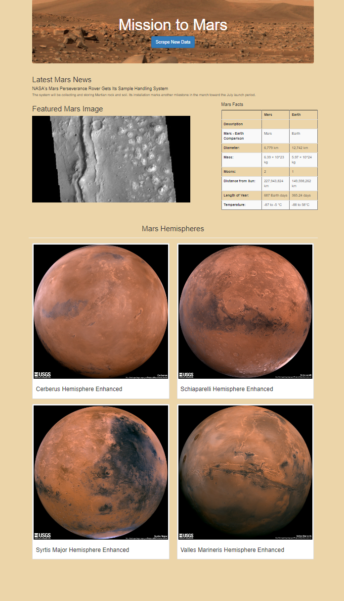

# Mission_to_Mars

## Project Overview: 

<b>

In this project, `Splinter` was used to automate a web browser, `BeautifulSoup` to parse and extract the data, and `MongoDB` to hold the data that has been gathered in a `NoSQL` database. Using this technique, we have the ability to pull data from multiple websites, store it in a database, then present it in a central location: a webpage.

 

 

## Methodology:

 A Python script was written to scrape text, images, and other data from multiple websites with information on the Mission to Mars. An HTML template was written for the Flask web application to display the gathered information on a single webpage. The information that was scraped was stored in MongoDB(a non-relational database). 

## Resources:

- Web pages scraped:
    - https://redplanetscience.com
    - https://spaceimages-mars.com
    - https://galaxyfacts-mars.com
    - https://marshemispheres.com

 

- Software:
    - MongoDB, Mongosh, MongoDB-Compass, PyMongo
    - Splinter, BeautifulSoup, HTML5, Bootstrap
    - Google Chrome, Div Tools
    - Jupyter Notebook/Lab
    - Python
    - Flask
    - VS Code

 

- Code for reference:
    - HTML index template: `index.html` (located in the `templates` folder)
    - Flask App: `app.py`
    - Scraping: `scraping.py`

 

# Data collected:

 ### Flask in use: 

 

### The Hemispheres that were scraped: (place your mouse over each image to display the name of the hemisphere)

 

   

### The featured image of clouds on mars:

 

 

### The DataFrame created with pandas from information scraped: 

 

 

# Final Result:

The Final Product is a fully operative, organized web-app displaying all information in a central location: a website. The Flask application was ran and information was made available on a server. Each time the `"Scrape New Data"` button was clicked, our website and database information was updated with newly scraped information to include images, the latest article title, and a short news description from NASA's site.

Server: `127.0.0.1:5000`

 

